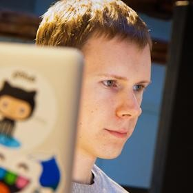

<iframe height="200px" width="100%" frameborder="no" scrolling="no" seamless src="https://player.simplecast.com/1a996068-9b8d-40b9-b396-2c53302b1234?dark=false"></iframe>

Bartek pratar med [Pelle Wessman](https://twitter.com/voxpelli), som jobbar som tech lead för Sydsvenskan och Helsingborgs Dagblad. De diskuterar distribuerade sociala nätverk, men vad menas egentligen med att det? Hur ser möjligheterna ut för att starta ett nytt socialt nätverk? 

I veckans avsnitt pratar Pelle och Bartek också om de problem som kan uppstå med gatekeepers inom sociala nätverk. Stora företag har mycket makt och möjligheter att kunna göra saker som att kunna filtrera och blockera våra inlägg och profiler om vi har ett suspekt beteende eller om de anser att vi uttrycker oss fel. Detta är mycket bra i många lägen, för att bland annat förhindra hackers och rasistiska åsikter och liknande. Men det kan också vara dåligt eftersom man i själva verket inte har lika stor yttrandefrihet längre. 
Var går de moraliska gränserna för hur mycket de stora företaget får eller bör filtrera? 

En mycket intressant diskussion om den makt som de stora företagen inom sociala medier har och vilka moraliska förpliktelser det egentligen innebär. Häng med och lyssna!

Lyssna på [Spotify](https://open.spotify.com/episode/4egBFz5KEPxdDqZswEVa3f) | [iTunes](https://podcasts.apple.com/se/podcast/kompilator/id1455198510?ign-mpt=uo%3D4&mt=2#) | [Overcast](https://overcast.fm/+RBmn0FZGM)

## Veckans gäst
_Pelle har kodat ända sedan lågstadiet – resan började med QBasic i DOS, men sedan länge är det såklart webben som gäller. Nyfiken som han är har han testat på mycket – frilansande, byrå, konsult, startup, storföretag – men genom allt har en röd tråd ändå funnits: Fascinationen över webbens demokratiserande effekt och en vilja att bidra till att pusha den längre för att möjliggöra mer och större kreativitet._

## Talking points:
* Distribuerade sociala nätverk
* Från bloggar till mikrobloggar
* Hur bygger man webbsidor från grunden
* Problem med gatekeepers inom sociala nätverk

## Länkar
* [IndieWeb Priciples](https://indieweb.org/principles)
* [hH-entry](https://indieweb.org/h-entry)
* [Webmention](https://webmention.net/)
* [Micropub](https://micropub.net/)
* [bridgy](https://brid.gy/)
* [Netlify](https://www.netlify.com/)
* [Github Pages](https://pages.github.com/)
* [Jekyll](https://indieweb.org/Jekyll)

## Citerbara citat
> “Idag kan dom som vill börja med webbutveckling och börja vara en som bygger webben inte riktigt göra det, för de måste i så fall först skaffa sig en anställning på Twitter, Facebook eller något för att överhuvudtaget kunna bidra till att de sociala medierna utvecklas.” 

> “Om du centraliserar allting till ett ställe, då får det centrala stället möjligheter att göra saker och ting, som att till exempel blocka dig för att du har ett suspekt beteende. Och man får möjligheter att göra saker och ting, som att filtrera och blockera, då får du också en moraliskt förpliktelse att göra det.”

> “Sen är frågan ur det lite större perspektivet om det är rimligt att en person eller företag som innehar makten, att så hårt kunna styra hur folk uttrycker sig och om vad som är rätt och vad som är fel.”